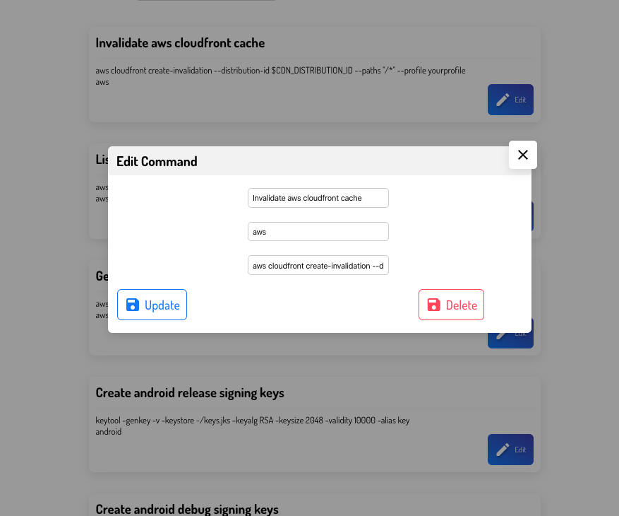

# commandpalour2
> A simple electron and vue app for saving commands and short notes for later use.

#### Demo





#### Build Setup

``` bash
# install dependencies
npm install

# serve with hot reload at localhost:9080
npm run dev

# build electron application for production
npm run build


# lint all JS/Vue component files in `src/`
npm run lint

```

---
